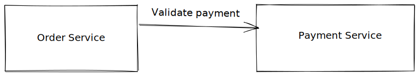
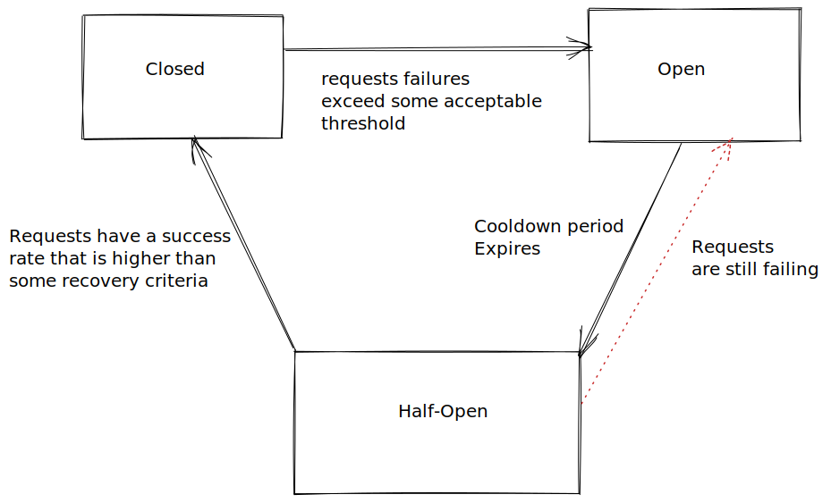

# circuitbreaker
This is a go implementation of the  Circuit Breaker pattern.



Imagine you have two services, the order and payment services as shown on the diagram above. Now, suppose the Order service needs to make a request to the payment service, for example, to validate customer payment. There are possibly two kinds of failure that can occur in this situation:

- Short Intermittent Failures: These happen from time to time and are somewhate expected. For instance, if your service SLA maintains a 99% availablility, then there is a 1% chance any request could fail. In this case, retrying the request can remedy the situation.

- Long Unanticipated Failures: this could be because the payment service is down due to deployment issue, or some production issue. In this situation retrying request probably wont help because of the nature and duration of the failure. 

In fact, suppose that the order service blocks on these calls. Now, The order server can only do so many requests at a time. In the worst case, every one of your request to the orders service needs to make a failing call to the payment service. Eventually, you might run into a sitation where all the resources in the Order service have been exhausted and it cant take any more requests. As a result, the order service is effectively down, resulting in this cascading failure. 

To avoid this situation, it would have been better for the order service to not make anymore request to the payment service, and allow the payment service some timeout to recover. The order service could in the meantime simply fail the request immediately, or in a different situation return a cached value. This in a nutshell is the Circuit Breaker Pattern.

The Circuit breaker pattern, helps alleviate failing requests by acting as a request interceptor. The Interceptor manages the requests by using a state machine that looks like the following diagram:



As we can see there are 3 states, and they are described as follows:
- `Closed` State: 
    - This is the normal state where requests against the payment service are being executed.
- `Open` State: 
    - the Interceptor enters this state when the calls to the payment service have failed too many times. 
    - Once it is in this state, no request to the Payment service would be executed for some timeout duration, also known in my implementation as `CooldownDuration`.
    - The criteria for this failure can vary from one implementation to another. The simplest way is to count successive failures and `open` the circuit if it is over a certain amount. 
    - The implementation in this repo, attempts to calculate the failure rate over the duration of the last N calls and check if it is higher than a configured threshold `FailureRate`.
- `Half-Open` State:
    - Once the `CooldownDuration` has expired on the `open` state the Interceptor transition into this state. The idea here is to test the waters and `verify` that the payment service has actually recovered.
    - Only a subset of request goes through ( say 10 % of the normal request window ) - if the failure continues or the success is not yet on par with what we hope, we send the Interceptor back to the `Open` state
    - Otherwise, if the request are passing and they have recovered over some `RecoveryRate` threshold, then we can assume that the payment service has recovered. In this case, transition the interceptor back to the `closed` state.


To read more about this pattern, visit this [Blog by Microsoft](https://docs.microsoft.com/en-us/azure/architecture/patterns/circuit-breaker).

## Install
```sh
go get -u github.com/aelnahas/circuitbreaker
```

## Examples
A basic usage can be seen in the  implementation


## Settings

### Thresholds

There are thresholds being used in the implementation to guide the interceptor throught the states. The following table describes them:


| Name | Description | Type | Default |
| --- | --- | --- | --- |
| FailureRate | Acceptable rate of failures , if exceeded interceptor will switch to Open state | float64 | 10.0 |
| RecoveryRate | in `Half-Open` state, this threshold is used to determine if the service being requested has "recovered" and it is okay to go back to `Closed` state | float64 | 10.0 |
| CooldownDuration | the `duration` where the interceptor will remain in `open` and not forward any requests | time.Duration | 30 seconds |
| MaxRequestOnHalfOpen | Number of requests that are allowed to be executed in Half-open state | int | 10 | 

